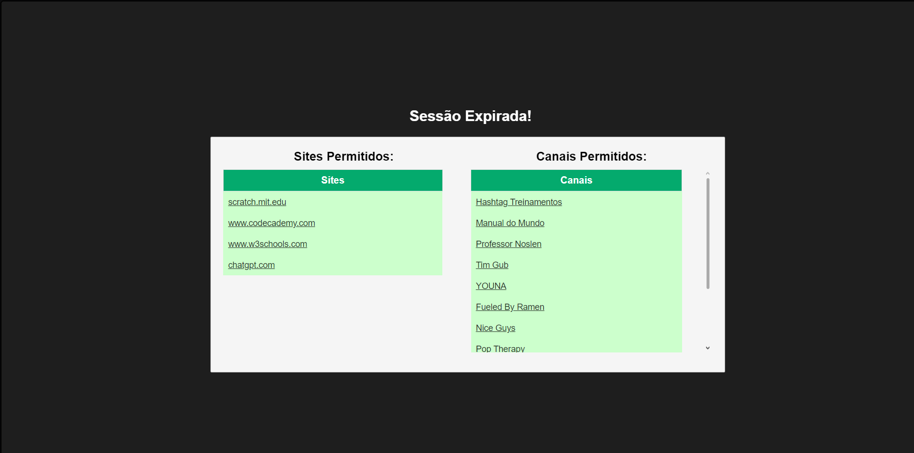
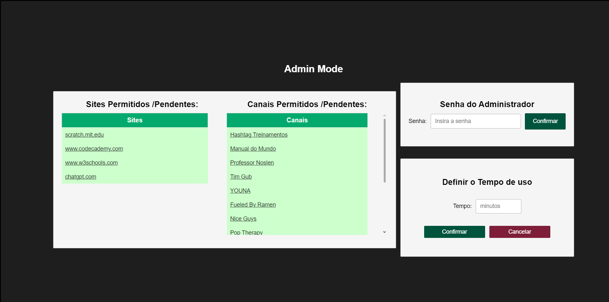
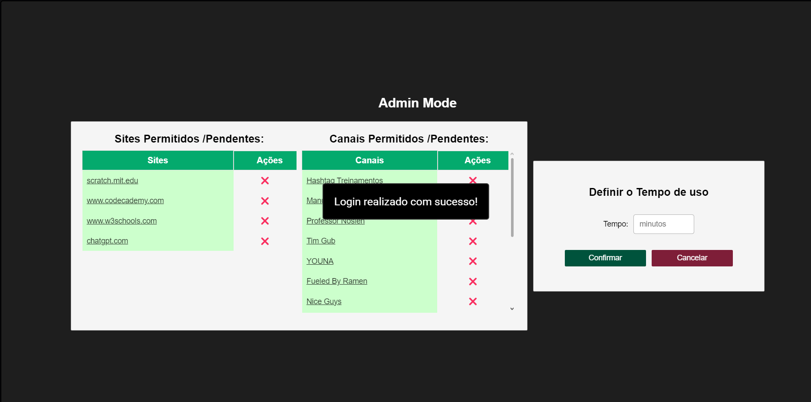
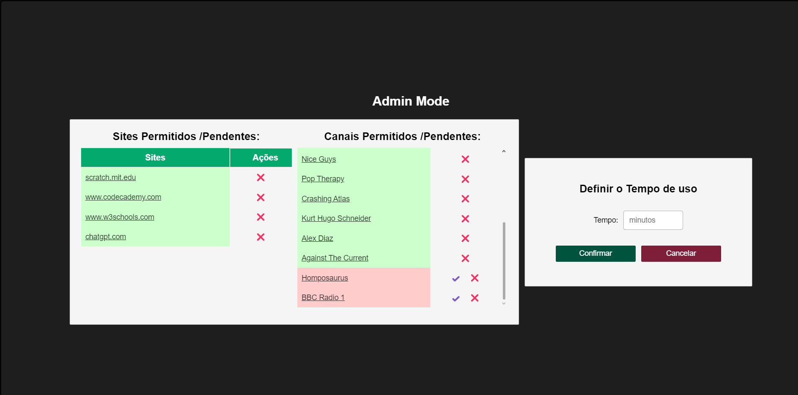

# Daily Usage Limiter for Browsers

A userscript that limits daily browsing time with notifications and automatic blocking once the set time is reached. Ideal for managing daily internet usage in shared environments like internet cafés and study centers, and can also be used for parental control.

## Features

- **Daily Time Limit**: The script limits daily browsing time, with the user being notified as the time approaches its limit. Notifications will be sent at ***30 minutes***, ***15 minutes***, ***5 minutes***, and ***1 minute*** before the limit is reached.

- **Automatic Blocking**: Once the configured time limit is reached, **access to non-permitted sites and channels is ***automatically blocked*****.

- **Admin Interface**: An admin interface, protected by a password, allows you to configure the ***maximum usage time***, ***add*** or ***remove*** ***allowed sites and channels***, or ***view the current usage status***.

- **Parental Control and Shared Environments**: Ideal for ***managing internet usage time***, whether in a family environment for parental control or in shared spaces like internet cafés.

- **Admin Panel**: The admin panel provides more detailed options for controlling both ***allowed sites and allowed channels***. It also ***allows viewing pending sites and channels*** that have yet to be approved.

- **YouTube Channel Management**: The script supports ***restricting access to specific YouTube channels***. The allowedChannels array ensures only selected channels can be accessed.

- **Pending Sites and Channels**: There is a list of ***pending sites and channels*** that are ***awaiting approval***, which can be managed directly from the ***admin panel***.

- **Media Stopping**: Once the ***time limit*** is reached, the script will ***automatically stop all media***, including audio, video, and mini-player elements, for a more effective session end.

## How to Install

1. **Install the Tampermonkey Extension**:
   - Download and install the [Tampermonkey](https://www.tampermonkey.net/) extension in your browser.
   
2. **Create a New Script**:
   - Open the Tampermonkey dashboard and create a new script.
   - Paste the provided code (the script code you shared).
   - Save the script.

3. **Initial Configuration**:
   - After installation, the script will start working automatically.
   - The maximum browsing time is set to 2 hours by default, but it can be adjusted via the admin interface (see below).

> [!NOTE]  
> It is important to block the browser's video miniplayer for a better experience with this userscript when using it to block YouTube videos after the time limit is reached.

## Customization

You can customize the script by adjusting the following settings directly in the code:

- **Maximum Usage Time**: Modify the value of `DEFAULT_MAX_USAGE_TIME` for the desired maximum time in minutes. The default value is 120 minutes (2 hours).
  
  Example: To set a 1-hour limit, change it to `const DEFAULT_MAX_USAGE_TIME = 60;`.

- **Allowed Sites**: Add or remove URLs from the allowed sites list (`allowedSites`) to grant unrestricted access to those sites.

  Example:
  ```javascript
  const allowedSites = [
    "https://example.com", // Add initial sites that you want to allow here.
    "https://another-example.com"
  ];
  
- **Allowed Channels**: Similar to sites, add or remove allowed channels from the list (`allowedChannels`) to grant ***unrestricted access*** to those channels.

- **Admin Password**: The default admin panel password is `"BebaAwa"`. To change it, simply edit the value of `ADMIN_PASSWORD`.

## How to Use

- **Time Notifications**: The script will notify automatically the user with ***30 minutes***, ***15 minutes***, ***5 minutes***, and ***1 minute*** warnings before the time limit is reached. To show the ***Time Notification*** manually ***press the (Shift + T) keys*** ~~(modify the `showRemainingTimeKey` variable to change the button that is pressed)~~.

- **Site and Channel Blocking**: When the **maximum browsing time** is reached, the script will automatically block access to **non-permitted sites**.
  
- **Admin Panel Access**: To access the ***admin interface*** ***press the * key*** ~~(modify the `openCloseAdminPanelKey` variable to change the button that is pressed)~~. It shows the sites and channels availables. To enter in ***admin mode*** see below.

- **Admin Mode**: To access the ***admin mode*** and configure the usage time or modify the allowed sites and channels, ***press the (Shift + P) keys*** ~~(modify the `showAdminContentKey` variable to change the button that is pressed)~~. The ***admin password*** will be required to add or remove channels and sites, as well as to reset the usage time.
  
- **Pending Sites and Channels**: The admin panel now displays a list of ***pending sites and channels awaiting approval***. These can be reviewed and approved directly from the admin interface.

- **YouTube Channel Management**: The script ***restricts access based on specific YouTube channels***. ***Only approved channels*** from the allowedChannels list ***will be accessible*** when the time limit is reached.

- **Media Stop**: Once the time limit is reached, the script will ***stop all media***, including videos, audios, and other embedded content on the page.

## Screenshots

### End Session

Displays the list of allowed sites and channels.



### Admin Mode

Shows the admin mode, where you can log in, set the time when logged in, and perform admin actions.



### Logged In



### Admin Actions

Displays the available admin actions, such as approving or rejecting site/channel requests, and removing allowed site/channel.



### Show Time Notification

Shows a time limit notification alert.


